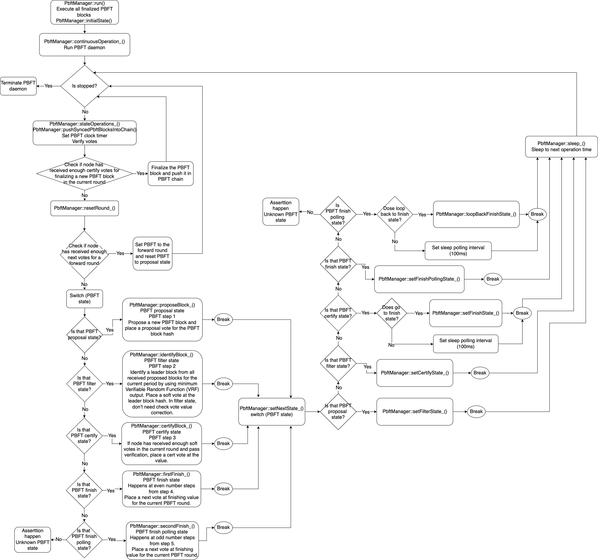
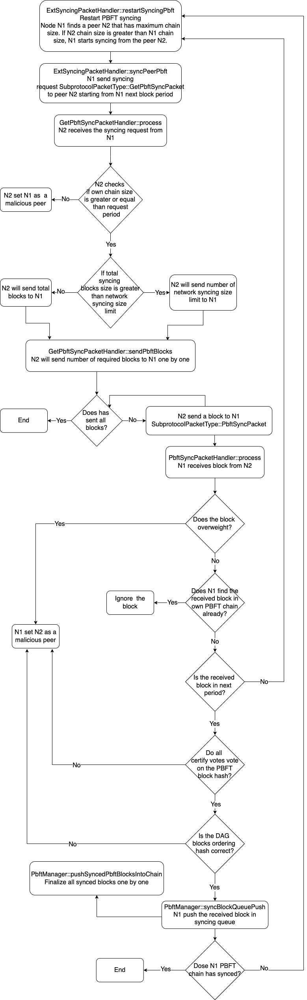

# PBFT

According to paper [ALGORAND AGREEMENT Super Fast and Partition Resilient Byzantine Agreement](https://eprint.iacr.org/2018/377.pdf), implement PBFT manager for finalizing DAG blocks.

There are 5 states in one PBFT round: proposal state, filter state, certify state, finish state, and finish polling state.
 - Proposal state: PBFT step 1. Generate a PBFT block and propose a vote on the block hash
 - Filter state: PBFT step 2. Identify a leader block from all received proposed blocks for the current period by using minimum Verifiable Random Function (VRF) output. Soft vote at the leader block hash. In filter state, don’t need check vote value correction.
 - Certify state: PBFT step 3. If receive enough soft votes, cert vote at the value. If receive enough cert votes, finalize the PBFT block and push it to PBFT chain.
 - Finish state: Happens at even number steps from step 4. Next vote at finishing value for the current PBFT round. If node receives enough next voting votes, PBFT goes to next round.
 - Finish polling state: Happens at odd number steps from step 5. Next vote at finishing value for the current PBFT round. If node receives enough next voting votes, PBFT goes to next round.

PBFT timing: All players keep a timer clock. The timer clock will reset to 0 at every new PBFT round. That doesn’t require all players clocks to be synchronized; it only requires that they have the same clock speed.
 - Proposal state: Reset clock to 0
 - Filter state: Start at clock 2 lambda time
 - Certify state: Start after filter state, clock is between 2 lambda and 4 lambda duration
 - Finish state: Start at 4 lambda time, until receive enough next voting votes to go to next round
 - Finish polling state: Start after first finish state. If node receives enough next voting votes within 2 lambda duration, PBFT will go to next round. Otherwise that will go back to Finish state.

## General flow 

## PBFT Manager

PbftManager class is a daemon that is used to finalize a bench of directed acyclic graph (DAG) blocks by using Practical Byzantine Fault Tolerance (PBFT) protocol

Link to whitepaper for [PBFT Rapid Finalization](https://docs.taraxa.io/tech-whitepaper/taraxa-architecture#2.3-rapid-finalization)

## Syncing

Nodes PBFT chain may be behind peers PBFT chain. At that time, nodes will sync up PBFT chain from peers. The flow chart below displays PBFT chain syncing from a node to another node. All synced PBFT blocks will be stored in SyncBlockQueue first, and PbftManager will process the synced PBFT blocks later.

