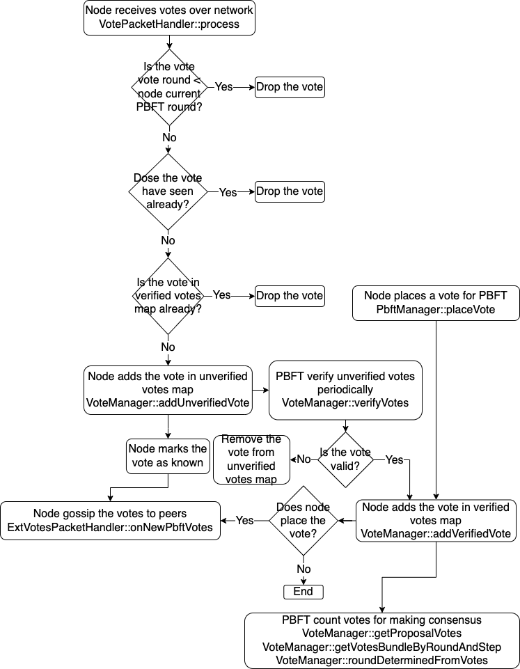
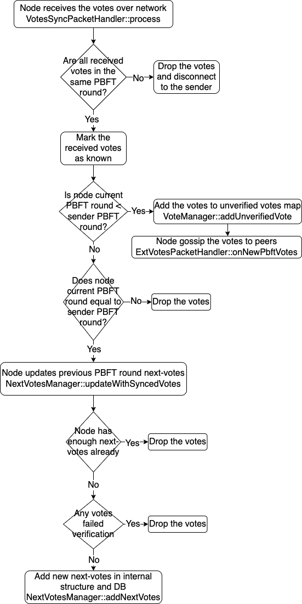

# Vote

There are 4 types for vote, proposal vote type, soft vote type, cert vote type, and next vote type.

Link to Doxygen generated docs. [Vote type](https://taraxa-project.github.io/taraxa-node/group___vote.html#ga8a0770e242b649865f15f20a405507cc)

## VRF PBFT message

VrfPbftMsg struct uses vote type, PBFT round, and PBFT step to generate a message for doing VRF sortition.

Link to Doxygen generated docs with methods list. [VrfPbftMsg struct](https://taraxa-project.github.io/taraxa-node/group___vote.html#structtaraxa_1_1_vrf_pbft_msg)

## Hashable VRF

HashableVrf struct uses VRF output, voter address, and vote weight index to calculate a hash number.

Link to Doxygen generated docs with methods list. [HashableVrf struct](https://taraxa-project.github.io/taraxa-node/group___vote.html#structtaraxa_1_1_hashable_vrf)

## VRF PBFT Sortition

VrfPbftSortition class used for doing VRF sortition to place a vote or to propose a new PBFT block

Link to Doxygen generated docs with methods list. [VrfPbftSortition class](https://taraxa-project.github.io/taraxa-node/group___vote.html#classtaraxa_1_1_vrf_pbft_sortition)

## Vote

Vote is a vote class that includes vote hash, vote on PBFT block hash, vote signature, VRF sortition, voter public key, voter address, and vote weight.

Link to Doxygen generated docs with methods list. [Vote class](https://taraxa-project.github.io/taraxa-node/group___vote.html#classtaraxa_1_1_vote)

## Votes Bundle

VotesBundle struct stores a bunch of votes that vote on the same voting value in the specific PBFT round and step, the total votes weights must be greater than PBFT sortition threshold.

Link to Doxygen generated docs. [VotesBundle struct](https://taraxa-project.github.io/taraxa-node/group___vote.html#structtaraxa_1_1_votes_bundle)

## Vote Manager

VoteManager class manage votes for PBFT consensus.

Link to Doxygen generated docs with methods list. [VoteManager class](https://taraxa-project.github.io/taraxa-node/group___vote.html#classtaraxa_1_1_vote_manager)

## Next-Votes Manager

NextVotesManager class manage next voting type votes for previous PBFT round.

Node could send previous PBFT round next voting type votes to help peers catch up to the current PBFT round. Also, node could receive enough next voting type votes from peers, to help node itself catch up to the correct PBFT round in consensus.

Link to Doxygen generated docs with methods list. [NextVotesManager class](https://taraxa-project.github.io/taraxa-node/group___vote.html#classtaraxa_1_1_next_votes_manager)

