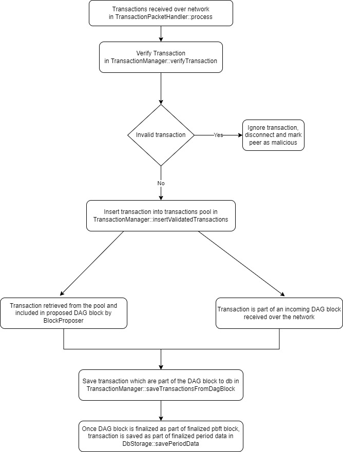

# Transaction

Transaction class in Taraxa is compatible to Ethereum transaction. RLP serialization/deserialization matches Ethereum transaction with the chain id set to Taraxa network chain ID. Transaction within Taraxa Node can have one of these three valid states:

* In transaction memory pool waiting to be included in a DAG block
* Transaction included in a non-finalized DAG block
* Transaction included in a finalized DAG block and saved in finalized period data

Transaction flow is displayed in the flow chart which references classes and functions within Taraxa Node codebase:

